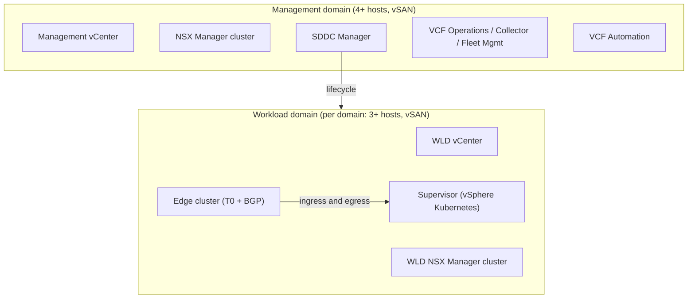

# Architecture

## Design principles

This framework was designed for **greenfield VCF 9.1** deployments after
studying the common failure modes of monolithic and copy-paste automation:

1. **One site definition.** All design intent lives in `iac/config/site.yaml`.
   Stages never define infrastructure facts of their own; they translate
   the site definition into provider resources. There is nothing to keep
   in sync.

2. **Isolated state per lifecycle phase.** Bring-up, capacity, domains,
   routing and Kubernetes have different lifecycles, blast radii and change
   frequencies. Each stage owns its own Terraform state, so a mistake while
   iterating on an edge cluster can never taint the management domain.

3. **Explicit hand-offs, no hand-copying.** Where a later stage needs data
   produced by an earlier one (host UUIDs from commissioning), it reads the
   earlier stage's state — operators never copy UUIDs or IDs between files.

4. **Secrets are structurally separate.** The site definition is designed
   to be committed and reviewed; passwords are typed, `sensitive`
   Terraform variables that only exist in git-ignored files or environment
   variables.

5. **Validate before you burn hours.** `iac/scripts/preflight.sh` checks the
   things that actually break bring-ups (DNS forward/reverse, NTP, host
   reachability) in seconds, before a 3-hour bring-up fails at minute 90.

## Deployment pipeline

Dashed nodes are manual gates in the VCF Installer / VCF Operations UI
(Broadcom steps 3 and 5); solid nodes are Terraform stages.

```mermaid
flowchart LR
    subgraph day0 ["Day 0 - Foundation"]
        S00["00 installer<br/>(ovftool script)"] --> GDEP["depot + binaries<br/>(Installer UI)"]
        GDEP --> S10["10 management domain<br/>(vcf_instance)"]
    end
    subgraph day1 ["Day 1 - Capacity and domains"]
        S20["20 network pools<br/>(vcf_network_pool)"] --> S30["30 host commission<br/>(vcf_host)"]
        S30 --> S40["40 workload domain<br/>(vcf_domain)"]
        S40 --> S50["50 edge cluster<br/>(vcf_edge_cluster)"]
    end
    subgraph day2 ["Day 1.5 - Platform services"]
        S60["60 supervisor<br/>(vsphere_supervisor)"]
    end
    S10 --> GLIC["license + register<br/>(VCF Operations UI)"]
    GLIC --> S20
    S50 --> S60

    classDef gate stroke-dasharray: 5 5;
    class GDEP,GLIC gate;
```

| Stage | Endpoint it talks to | State it owns |
|-------|----------------------|---------------|
| 00    | ESXi seed host (ovftool) | none (one-shot) |
| 10    | VCF Installer            | management domain |
| 20    | SDDC Manager             | network pools |
| 30    | SDDC Manager             | commissioned hosts |
| 40    | SDDC Manager             | workload domains |
| 50    | SDDC Manager             | edge clusters |
| 60    | WLD vCenter + NSX        | supervisor + content library |

## What gets deployed

## Network reference model

Eight VLANs cover a single-rack site (the example plan in
`site.example.yaml` uses `172.16.x.0/24` throughout):

| Purpose | Example VLAN | Notes |
|---------|--------------|-------|
| ESXi management | 1610 | vmk0, MTU 1500 acceptable |
| VM management (appliances) | 1611 | vCenter, NSX, SDDC Manager, fleet |
| vMotion | 1612 | MTU 9000 |
| vSAN | 1613 | MTU 9000 |
| Host TEP | 1614 | MTU 1700+, 9000 recommended |
| Edge TEP | 1635 | Routable to host TEP |
| Edge uplink 1 | 1620 | eBGP to fabric router 1 |
| Edge uplink 2 | 1621 | eBGP to fabric router 2 |

Workload domains add their own vMotion / vSAN / host-TEP VLANs (1632-1634
in the example).

## Scaling the model

- **More workload domains**: add an entry under `workload_domains`, a pool
  under `network_pools`, hosts under `commission_hosts` — re-apply stages
  20, 30, 40.
- **More clusters in a domain**: add to that domain's `clusters` map.
- **More racks**: one network pool per rack keeps addressing honest.
- **Multiple sites**: one repo clone (or branch/workspace) per site; each
  gets its own `site.yaml`. Everything else is identical.
